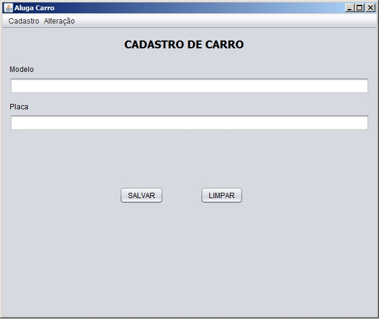
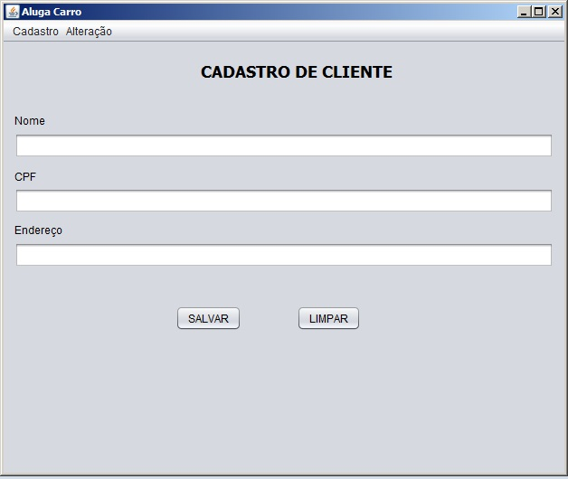
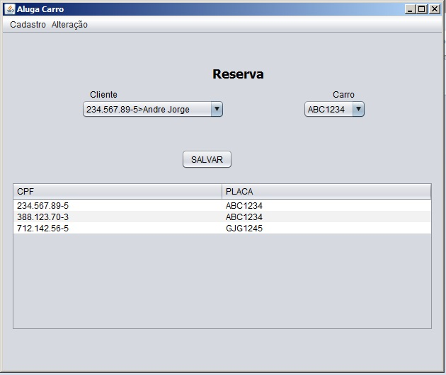
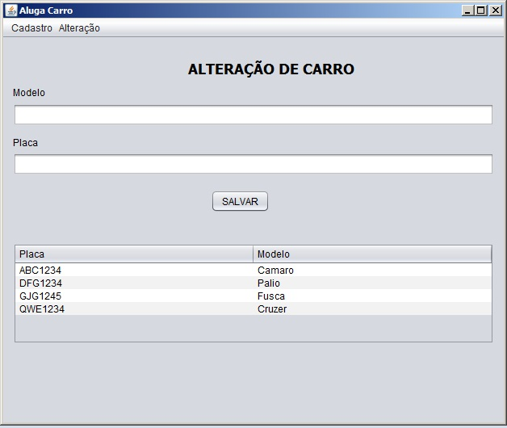
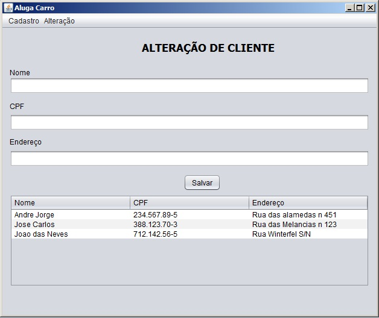

# UFOP|ICEA - Engenharia de Software 17.2
- Prof. Euler Horta Marinho.

# Grupo 
- Isabela Cristina - 15.2.8109
- Jefte Ebiasafe - 15.2.8017
- Jucélia Carvalho - 12.1.8438
- Lucas Dau F. Souza - 14.1.8320

# How to use
- Install MySql and Java VM
- Para inicializar o BD é necessário que o script.sql seja executado no MySql
- Arquivo JAR se encontra na pasta "\AlugaCarro\dist\AlugaCarro.jar"

# Aparência do Programa

#
